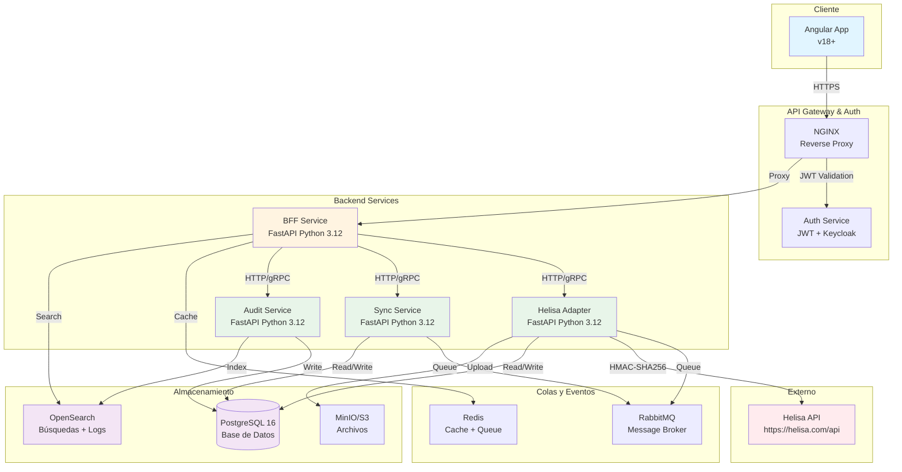
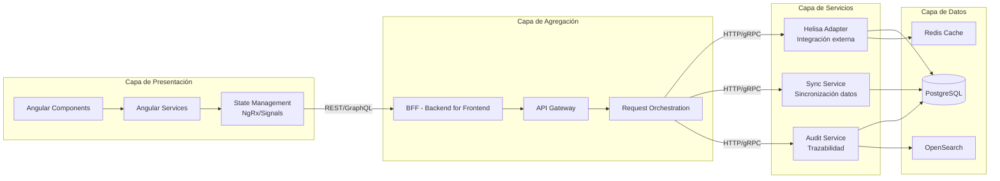
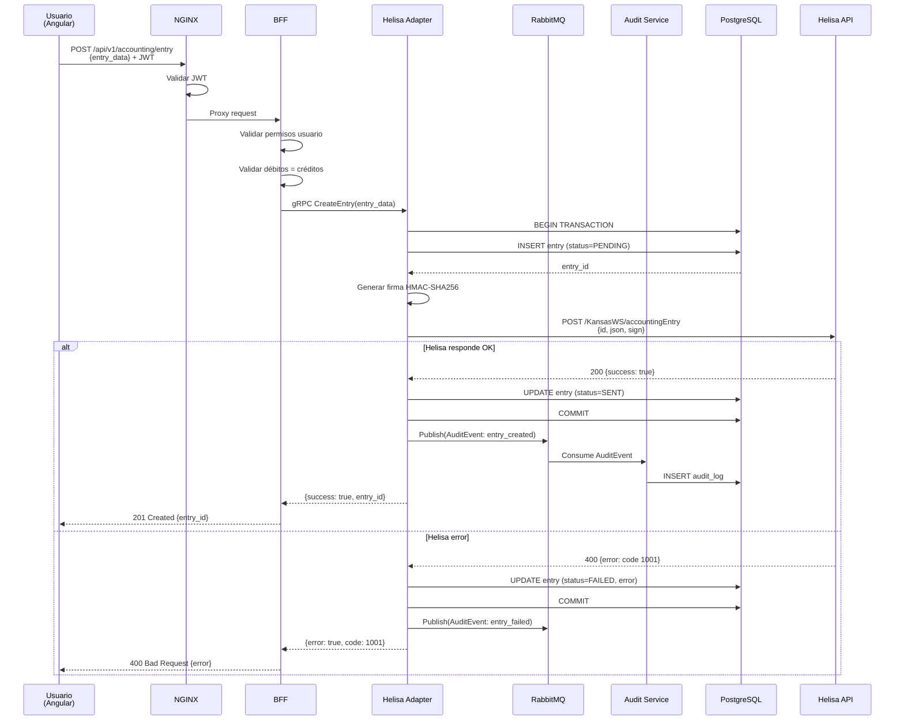
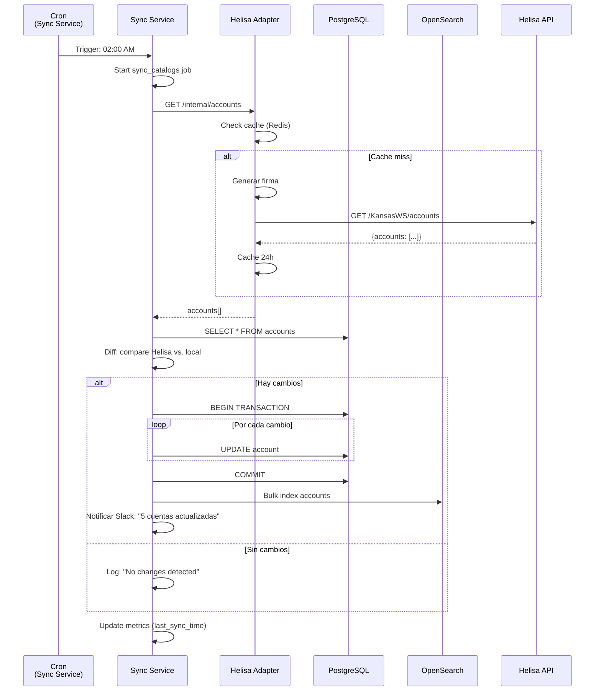
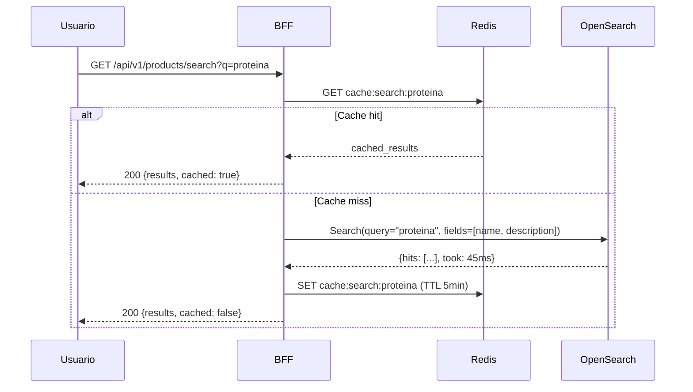

# Arquitectura de Solución: Helisa Innovate Services

## Tabla de Contenidos
- [Visión General](#visión-general)
- [Arquitectura de Alto Nivel](#arquitectura-de-alto-nivel)
- [Decisiones de Diseño](#decisiones-de-diseño)
- [Componentes del Sistema](#componentes-del-sistema)
- [Flujos de Datos](#flujos-de-datos)
- [Patrones Arquitectónicos](#patrones-arquitectónicos)
- [Stack Tecnológico](#stack-tecnológico)
- [Escalabilidad y Rendimiento](#escalabilidad-y-rendimiento)

---

## Visión General

### Objetivo del Sistema
Crear una plataforma de integración robusta y escalable entre **Innovate Nutrition** y el sistema ERP **Helisa**, permitiendo:
- Sincronización bidireccional de datos contables, inventario y ventas
- Gestión centralizada de transacciones
- Auditoría completa de operaciones
- Experiencia de usuario moderna con Angular
- API segura y eficiente

### Principios de Diseño
1. **Seguridad por defecto**: Autenticación JWT, validación de dominios, cifrado en tránsito
2. **Separación de responsabilidades**: Frontend, BFF, microservicios especializados
3. **Escalabilidad horizontal**: Contenedores, orquestación K8s
4. **Observabilidad**: Logging estructurado, métricas, trazabilidad
5. **Resiliencia**: Circuit breakers, reintentos, fallback

---

## Arquitectura de Alto Nivel

### Diagrama General del Sistema



### Diagrama de Capas



---

## Decisiones de Diseño

### 1. ¿Por qué Backend for Frontend (BFF)?

**Decisión**: Implementar un BFF entre Angular y los microservicios.

**Razones**:
- **Agregación de datos**: El BFF consolida múltiples llamadas a microservicios en una sola respuesta optimizada para el frontend
- **Transformación de datos**: Convierte formatos internos (PostgreSQL, Helisa) a estructuras optimizadas para Angular
- **Seguridad centralizada**: Punto único de validación JWT y permisos
- **Reducción de latencia**: Minimiza round-trips del cliente
- **Versionado de API**: Permite evolucionar el backend sin romper el frontend
- **Caché inteligente**: Redis en el BFF mejora tiempos de respuesta

**Ejemplo de flujo**:
```
Angular solicita "dashboard de ventas" → BFF agrega:
  - Ventas del día (Sync Service)
  - Productos más vendidos (Helisa Adapter)
  - Alertas de inventario (Sync Service)
  - Log de auditoría (Audit Service)
→ Retorna JSON consolidado en < 300ms
```

### 2. ¿Por qué Eventos Asíncronos (RabbitMQ)?

**Decisión**: Usar message broker para operaciones no críticas en tiempo real.

**Razones**:
- **Desacoplamiento**: Los servicios no dependen de disponibilidad síncrona
- **Resiliencia**: Si Helisa API falla, mensajes quedan encolados para reintento
- **Escalabilidad**: Workers independientes procesan mensajes en paralelo
- **Auditoría garantizada**: Eventos de auditoría nunca se pierden

**Casos de uso**:
```yaml
Eventos síncronos (HTTP):
  - Consulta de saldo de cuenta
  - Validación de producto
  - Autenticación de usuario

Eventos asíncronos (RabbitMQ):
  - Sincronización nocturna de catálogos
  - Envío de comprobantes contables a Helisa
  - Generación de reportes pesados
  - Indexación en OpenSearch
```

### 3. ¿Por qué gRPC opcional entre servicios internos?

**Decisión**: HTTP/REST por defecto, gRPC para comunicación de alta frecuencia.

**Razones**:
- **HTTP/REST**:
  - Estándar, fácil debugging
  - Compatible con navegadores (BFF → Cliente)
  - OpenAPI/Swagger para documentación
- **gRPC**:
  - 7x más rápido que HTTP/JSON en benchmarks
  - Streaming bidireccional (actualizaciones en tiempo real)
  - Tipado fuerte con Protocol Buffers
  - Ideal para BFF ↔ Microservicios internos

**Implementación recomendada**:
```
Angular ←→ BFF: HTTP/REST (público)
BFF ←→ Microservicios: gRPC (interno, opcional)
```

### 4. ¿Por qué OpenSearch además de PostgreSQL?

**Decisión**: PostgreSQL para datos transaccionales, OpenSearch para búsquedas y logs.

**Razones**:
- **PostgreSQL**:
  - ACID completo, integridad referencial
  - Transacciones complejas (débitos = créditos)
  - Relaciones complejas (facturas, productos, clientes)
- **OpenSearch**:
  - Full-text search en facturas, productos
  - Agregaciones rápidas (dashboards, reportes)
  - Logs centralizados de todos los servicios
  - Alertas en tiempo real (Kibana)

**Patrón**: Escritura en PostgreSQL → Replicación asíncrona a OpenSearch

---

## Componentes del Sistema

### 1. Frontend - Angular 18+

**Responsabilidades**:
- Interfaz de usuario moderna y responsive
- Gestión de estado con Signals/NgRx
- Validaciones de formularios
- Autenticación JWT en cliente

**Stack**:
```yaml
Framework: Angular 18+ (Standalone Components)
State: NgRx Signals (reemplaza NgRx Store clásico)
HTTP: HttpClient con interceptores JWT
Forms: Reactive Forms con validaciones async
UI: Angular Material / PrimeNG
Testing: Jasmine + Karma / Jest
```

**Estructura**:
```
apps/frontend/
├── src/
│   ├── app/
│   │   ├── core/                 # Servicios singleton
│   │   │   ├── auth/
│   │   │   ├── http/
│   │   │   └── guards/
│   │   ├── features/             # Módulos de negocio
│   │   │   ├── dashboard/
│   │   │   ├── accounting/       # Contabilidad
│   │   │   ├── inventory/        # Inventario
│   │   │   └── reports/          # Reportes
│   │   ├── shared/               # Componentes reutilizables
│   │   │   ├── components/
│   │   │   ├── directives/
│   │   │   └── pipes/
│   │   └── app.config.ts         # Config standalone
│   └── environments/
```

### 2. BFF - Backend for Frontend (FastAPI)

**Responsabilidades**:
- Agregación de respuestas de múltiples servicios
- Transformación de datos para Angular
- Caché de respuestas frecuentes
- Validación de JWT

**Stack**:
```yaml
Framework: FastAPI 0.110+
Runtime: Python 3.12
Async: asyncio, httpx para llamadas HTTP
Cache: Redis con TTL inteligente
Auth: python-jose para JWT
Docs: OpenAPI auto-generado
```

**Endpoints principales**:
```python
# Agregación
GET  /api/v1/dashboard          # Dashboard consolidado
GET  /api/v1/accounting/summary # Resumen contable + alertas

# Proxy inteligente
POST /api/v1/accounting/entry   # Crea comprobante → Helisa
GET  /api/v1/products/search    # Búsqueda → OpenSearch + cache

# Sincronización
POST /api/v1/sync/catalogs      # Trigger sincronización manual
GET  /api/v1/sync/status        # Estado de sincronizaciones
```

### 3. Helisa Adapter Service (FastAPI)

**Responsabilidades**:
- Integración exclusiva con API de Helisa
- Firma HMAC-SHA256 de todas las peticiones
- Gestión de errores y reintentos
- Cache de catálogos estáticos
- Persistencia de transacciones

**Stack**:
```yaml
Framework: FastAPI 0.110+
HMAC: hmac + hashlib (estándar Python)
HTTP: httpx con retry exponencial
DB: SQLAlchemy 2.0 + asyncpg
Queue: aio-pika (RabbitMQ async)
```

**Funcionalidades clave**:
```python
# Consultas (GET Helisa)
async def get_accounts(tipo: str) -> List[Account]
async def get_products() -> List[Product]
async def get_cost_centers() -> List[CostCenter]

# Inserciones (POST Helisa)
async def create_accounting_entry(entry: AccountingEntry) -> Response
async def create_inventory_movement(movement: InventoryMovement) -> Response

# Firma de seguridad
def generate_helisa_signature(data: dict, secret: str, client_id: str) -> dict
```

### 4. Sync Service (FastAPI)

**Responsabilidades**:
- Sincronización bidireccional de datos
- Jobs programados (catálogos nocturnos)
- Detección de cambios (delta sync)
- Reconciliación de inconsistencias

**Stack**:
```yaml
Framework: FastAPI 0.110+
Scheduler: APScheduler (cron jobs)
DB: SQLAlchemy 2.0 ORM
Diff: deepdiff para detectar cambios
Notifications: SMTP/Slack para alertas
```

**Jobs programados**:
```yaml
Diario 2:00 AM:
  - Sincronizar catálogo de cuentas
  - Sincronizar productos
  - Sincronizar terceros (clientes/proveedores)

Cada 15 minutos:
  - Verificar transacciones pendientes
  - Reintentar envíos fallidos

Cada hora:
  - Reconciliar saldos contables
  - Generar métricas de sincronización
```

### 5. Audit Service (FastAPI)

**Responsabilidades**:
- Registro inmutable de todas las operaciones
- Indexación en OpenSearch
- Dashboards de auditoría
- Alertas de seguridad

**Stack**:
```yaml
Framework: FastAPI 0.110+
DB: PostgreSQL (tabla append-only)
Search: OpenSearch Python client
Monitoring: Prometheus metrics
```

**Modelo de auditoría**:
```python
class AuditLog:
    id: UUID
    timestamp: datetime
    user_id: str
    user_email: str
    action: str  # CREATE, UPDATE, DELETE, READ
    resource: str  # accounting_entry, product, etc.
    resource_id: str
    changes: JSONB  # Before/after
    ip_address: str
    user_agent: str
    status: str  # SUCCESS, FAILURE
    error_message: Optional[str]
```

---

## Flujos de Datos

### Flujo 1: Creación de Comprobante Contable



### Flujo 2: Sincronización Nocturna de Catálogos



### Flujo 3: Búsqueda de Productos (Full-Text)



---

## Patrones Arquitectónicos

### 1. Circuit Breaker

**Problema**: Si Helisa API está caído, no queremos saturar con reintentos.

**Solución**: Implementar circuit breaker en Helisa Adapter.

```python
from circuitbreaker import circuit

@circuit(failure_threshold=5, recovery_timeout=60)
async def call_helisa_api(endpoint: str, data: dict):
    """
    Si 5 llamadas fallan, abre el circuito por 60 segundos.
    Durante ese tiempo, retorna error inmediatamente sin llamar.
    """
    response = await httpx_client.post(endpoint, data=data)
    return response
```

**Estados**:
- **Closed**: Funcionando normal
- **Open**: Demasiados errores → Rechaza llamadas inmediatamente
- **Half-Open**: Después de timeout → Prueba 1 llamada

### 2. Retry con Backoff Exponencial

**Problema**: Errores transitorios de red.

**Solución**: Reintentar con delays crecientes.

```python
from tenacity import retry, stop_after_attempt, wait_exponential

@retry(
    stop=stop_after_attempt(4),
    wait=wait_exponential(multiplier=1, min=2, max=16)
)
async def send_to_helisa(data: dict):
    """
    Intento 1: falla → espera 2s
    Intento 2: falla → espera 4s
    Intento 3: falla → espera 8s
    Intento 4: falla → raise exception
    """
    return await call_helisa_api(data)
```

### 3. Saga Pattern (Compensación)

**Problema**: Transacción distribuida que falla a mitad.

**Ejemplo**:
1. Guardar comprobante en PostgreSQL → ✅
2. Enviar a Helisa API → ❌ (falla)

**Solución**: Compensar (rollback) el paso 1.

```python
async def create_accounting_entry_saga(entry: Entry):
    # Paso 1: Local
    entry_id = await db.insert_entry(entry)

    try:
        # Paso 2: Helisa
        await helisa_adapter.send_entry(entry)
        await db.update_status(entry_id, "SENT")
    except HelisaAPIError:
        # Compensación
        await db.update_status(entry_id, "FAILED")
        await db.insert_retry_queue(entry_id)
        raise
```

### 4. CQRS (Command Query Responsibility Segregation)

**Concepto**: Separar escrituras (commands) de lecturas (queries).

**Implementación**:
```
Escrituras → PostgreSQL (maestro)
Lecturas rápidas → PostgreSQL (réplica read-only) + Redis cache
Búsquedas full-text → OpenSearch (replica asíncrona)
```

**Ventajas**:
- Escalabilidad: Múltiples réplicas de lectura
- Rendimiento: Cache sin afectar escrituras
- Separación de modelos: Escritura normalizada, lectura desnormalizada

---

## Stack Tecnológico

### Resumen Completo

| Componente | Tecnología | Versión | Justificación |
|------------|------------|---------|---------------|
| **Frontend** | Angular | 18+ | Framework moderno, standalone components |
| **State Management** | NgRx Signals | Latest | Reactividad nativa, menos boilerplate |
| **UI Library** | Angular Material | 18+ | Componentes enterprise, accesibilidad |
| **BFF** | FastAPI | 0.110+ | Performance, async nativo, OpenAPI |
| **Runtime** | Python | 3.12 | Últimas optimizaciones, mejor typing |
| **ORM** | SQLAlchemy | 2.0 | Async support, migrations con Alembic |
| **Database** | PostgreSQL | 16 | JSONB, full-text search, rendimiento |
| **Search Engine** | OpenSearch | 2.11+ | Compatible Elasticsearch, dashboards |
| **Cache** | Redis | 7+ | In-memory, pub/sub, queues ligeras |
| **Message Broker** | RabbitMQ | 3.12+ | AMQP estándar, management UI |
| **Reverse Proxy** | NGINX | 1.25+ | SSL termination, load balancing |
| **Auth** | Keycloak | 23+ | OAuth 2.0, OIDC, LDAP integration |
| **Container** | Docker | 24+ | Estándar de facto |
| **Orchestration** | Kubernetes | 1.29+ | Escalabilidad, self-healing |
| **CI/CD** | GitHub Actions | - | Integración nativa con repo |
| **Monitoring** | Prometheus + Grafana | Latest | Métricas time-series, alerting |
| **Logging** | ELK Stack | 8.11+ | Logs centralizados, Kibana |
| **Object Storage** | MinIO | Latest | S3-compatible, on-premise |

### Justificación de Versiones

**Python 3.12**:
- 25% más rápido que 3.11 en benchmarks
- Mejores mensajes de error
- Type hints mejorados

**PostgreSQL 16**:
- Logical replication mejorada
- Query performance +13% vs. 15
- Better monitoring

**Angular 18**:
- Signals = reactividad sin Zone.js
- Standalone = sin NgModules
- Hydration SSR mejorado

---

## Escalabilidad y Rendimiento

### Targets de Performance

| Métrica | Target | Medición |
|---------|--------|----------|
| **Latencia API (p95)** | < 300ms | BFF endpoints |
| **Latencia API (p99)** | < 500ms | BFF endpoints |
| **Throughput** | 1000 req/s | BFF total |
| **Disponibilidad** | 99.9% | 8.76h downtime/año |
| **Time to First Byte (TTFB)** | < 100ms | Frontend |
| **First Contentful Paint** | < 1.5s | Lighthouse |
| **Helisa API latency** | < 1s | Queries |
| **Helisa API latency** | < 3s | Writes |

### Estrategias de Escalabilidad

#### 1. Frontend (Angular)
```yaml
Optimizaciones:
  - Lazy loading de módulos
  - Virtual scrolling (grandes listas)
  - OnPush change detection
  - Service Workers (PWA)
  - Brotli compression (texto)
  - WebP images (imágenes)

CDN:
  - CloudFront / Cloudflare
  - Cache-Control: public, max-age=31536000 (assets)
  - Immutable URLs (hash en nombre archivo)
```

#### 2. BFF y Microservicios
```yaml
Horizontal Scaling:
  - Kubernetes HPA (Horizontal Pod Autoscaler)
  - Min replicas: 2
  - Max replicas: 10
  - Target CPU: 70%
  - Target Memory: 80%

Load Balancing:
  - Kubernetes Service (round-robin)
  - NGINX upstream (weighted)

Connection Pooling:
  - PostgreSQL: asyncpg con pool size 20
  - Redis: aioredis con pool
  - HTTP: httpx con límites
```

#### 3. Base de Datos
```yaml
PostgreSQL:
  - Réplicas de lectura: 2 (read-only)
  - Particionamiento: Por fecha en audit_logs
  - Índices: En campos de búsqueda frecuente
  - VACUUM automático: Configurado
  - Connection pooling: PgBouncer

Queries Optimizadas:
  - EXPLAIN ANALYZE en desarrollo
  - pg_stat_statements habilitado
  - Slow query log: > 100ms
```

#### 4. Caché Multinivel
```yaml
Nivel 1 - Navegador:
  - LocalStorage: Perfil usuario
  - SessionStorage: Estado temporal
  - HTTP Cache: Assets estáticos

Nivel 2 - BFF (Redis):
  - Catálogos: TTL 1h
  - Búsquedas: TTL 5min
  - Sesiones: TTL 24h

Nivel 3 - Microservicio (Redis):
  - Helisa responses: TTL 15min
  - Products: TTL 1h
```

### Monitoreo de Performance

```yaml
Métricas Clave:
  Application:
    - Request rate (req/s)
    - Error rate (%)
    - Latency percentiles (p50, p95, p99)
    - Active connections

  Infrastructure:
    - CPU usage (%)
    - Memory usage (%)
    - Disk I/O
    - Network throughput

  Business:
    - Comprobantes creados/hora
    - Sync jobs completados
    - Errores de Helisa API
    - Usuarios activos concurrentes

Alertas:
  Critical:
    - Error rate > 5% durante 5min
    - p99 latency > 1s durante 5min
    - Helisa API down

  Warning:
    - CPU > 85% durante 10min
    - Memory > 90%
    - Slow queries > 500ms
```

---

## Siguiente: Estructura de Monorepo

Ver [REPOSITORY_STRUCTURE.md](./REPOSITORY_STRUCTURE.md) para el árbol completo de carpetas.

---

**Versión**: 1.0
**Fecha**: 2024-11-08
**Autores**: Equipo de Arquitectura
