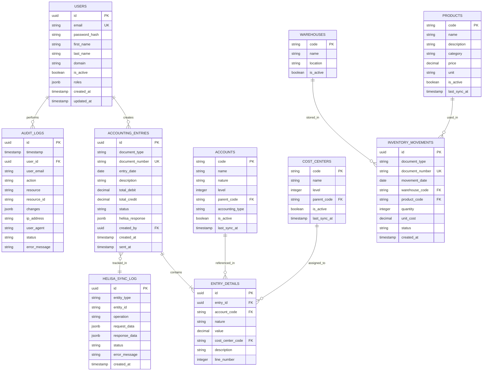
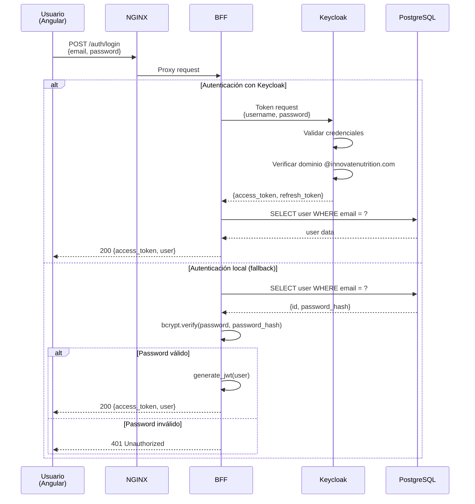

# Especificación Técnica: Helisa Innovate Services

## Tabla de Contenidos
- [Contratos de API (OpenAPI)](#contratos-de-api-openapi)
- [Esquemas de Base de Datos](#esquemas-de-base-de-datos)
- [Arquitectura de Seguridad](#arquitectura-de-seguridad)
- [Mappings de OpenSearch](#mappings-de-opensearch)

---

## Contratos de API (OpenAPI)

### BFF Service - API Pública

#### Endpoints Principales

##### 1. Autenticación

```yaml
openapi: 3.1.0
info:
  title: Helisa Innovate BFF API
  version: 1.0.0
  description: Backend for Frontend de Helisa Innovate Services

servers:
  - url: https://api.innovatenutrition.com/v1
    description: Producción
  - url: https://api-staging.innovatenutrition.com/v1
    description: Staging
  - url: http://localhost:8000/v1
    description: Desarrollo local

paths:
  /auth/login:
    post:
      summary: Login de usuario
      tags: [Autenticación]
      requestBody:
        required: true
        content:
          application/json:
            schema:
              type: object
              properties:
                email:
                  type: string
                  format: email
                  example: "user@innovatenutrition.com"
                password:
                  type: string
                  format: password
                  example: "SecureP@ss123"
              required: [email, password]
      responses:
        '200':
          description: Login exitoso
          content:
            application/json:
              schema:
                type: object
                properties:
                  access_token:
                    type: string
                    example: "eyJhbGciOiJIUzI1NiIsInR5cCI6IkpXVCJ9..."
                  refresh_token:
                    type: string
                  token_type:
                    type: string
                    example: "Bearer"
                  expires_in:
                    type: integer
                    example: 3600
                  user:
                    $ref: '#/components/schemas/User'
        '401':
          $ref: '#/components/responses/UnauthorizedError'
        '422':
          $ref: '#/components/responses/ValidationError'

  /auth/refresh:
    post:
      summary: Refrescar token
      tags: [Autenticación]
      security:
        - bearerAuth: []
      requestBody:
        content:
          application/json:
            schema:
              type: object
              properties:
                refresh_token:
                  type: string
      responses:
        '200':
          description: Token refrescado
          content:
            application/json:
              schema:
                type: object
                properties:
                  access_token:
                    type: string
                  expires_in:
                    type: integer
```

##### 2. Dashboard

```yaml
  /dashboard:
    get:
      summary: Dashboard consolidado
      description: Agrega datos de ventas, inventario y alertas
      tags: [Dashboard]
      security:
        - bearerAuth: []
      parameters:
        - name: date_from
          in: query
          schema:
            type: string
            format: date
            example: "2024-11-01"
        - name: date_to
          in: query
          schema:
            type: string
            format: date
            example: "2024-11-30"
      responses:
        '200':
          description: Dashboard data
          content:
            application/json:
              schema:
                type: object
                properties:
                  sales_summary:
                    type: object
                    properties:
                      total_sales:
                        type: number
                        example: 15000000
                      total_orders:
                        type: integer
                        example: 150
                      avg_ticket:
                        type: number
                        example: 100000
                  inventory_summary:
                    type: object
                    properties:
                      low_stock_products:
                        type: integer
                        example: 5
                      out_of_stock:
                        type: integer
                        example: 2
                      total_value:
                        type: number
                        example: 50000000
                  alerts:
                    type: array
                    items:
                      $ref: '#/components/schemas/Alert'
```

##### 3. Contabilidad

```yaml
  /accounting/entries:
    get:
      summary: Listar comprobantes contables
      tags: [Contabilidad]
      security:
        - bearerAuth: []
      parameters:
        - $ref: '#/components/parameters/PageParam'
        - $ref: '#/components/parameters/PageSizeParam'
        - name: document_type
          in: query
          schema:
            type: string
            enum: [CE, CI, NC, ND]
        - name: date_from
          in: query
          schema:
            type: string
            format: date
        - name: date_to
          in: query
          schema:
            type: string
            format: date
        - name: status
          in: query
          schema:
            type: string
            enum: [PENDING, SENT, FAILED]
      responses:
        '200':
          description: Lista de comprobantes
          content:
            application/json:
              schema:
                type: object
                properties:
                  items:
                    type: array
                    items:
                      $ref: '#/components/schemas/AccountingEntry'
                  total:
                    type: integer
                  page:
                    type: integer
                  page_size:
                    type: integer

    post:
      summary: Crear comprobante contable
      tags: [Contabilidad]
      security:
        - bearerAuth: []
      requestBody:
        required: true
        content:
          application/json:
            schema:
              $ref: '#/components/schemas/AccountingEntryCreate'
      responses:
        '201':
          description: Comprobante creado
          content:
            application/json:
              schema:
                $ref: '#/components/schemas/AccountingEntry'
        '400':
          $ref: '#/components/responses/BadRequestError'
        '422':
          $ref: '#/components/responses/ValidationError'

  /accounting/entries/{entry_id}:
    get:
      summary: Obtener comprobante por ID
      tags: [Contabilidad]
      security:
        - bearerAuth: []
      parameters:
        - name: entry_id
          in: path
          required: true
          schema:
            type: string
            format: uuid
      responses:
        '200':
          description: Detalle del comprobante
          content:
            application/json:
              schema:
                $ref: '#/components/schemas/AccountingEntry'
        '404':
          $ref: '#/components/responses/NotFoundError'
```

#### Schemas (Componentes)

```yaml
components:
  schemas:
    User:
      type: object
      properties:
        id:
          type: string
          format: uuid
        email:
          type: string
          format: email
        first_name:
          type: string
        last_name:
          type: string
        is_active:
          type: boolean
        roles:
          type: array
          items:
            type: string
        created_at:
          type: string
          format: date-time

    AccountingEntry:
      type: object
      properties:
        id:
          type: string
          format: uuid
        document_type:
          type: string
          enum: [CE, CI, NC, ND, FV, FC]
          example: "CE"
        document_number:
          type: string
          example: "CE-001234"
        date:
          $ref: '#/components/schemas/HelisaDate'
        description:
          type: string
          maxLength: 500
        total_debit:
          type: number
          minimum: 0
        total_credit:
          type: number
          minimum: 0
        status:
          type: string
          enum: [PENDING, SENT, FAILED]
        helisa_response:
          type: object
        details:
          type: array
          items:
            $ref: '#/components/schemas/EntryDetail'
        created_by:
          type: string
          format: uuid
        created_at:
          type: string
          format: date-time
        sent_at:
          type: string
          format: date-time

    AccountingEntryCreate:
      type: object
      required:
        - document_type
        - date
        - description
        - details
      properties:
        document_type:
          type: string
          enum: [CE, CI, NC, ND]
        date:
          $ref: '#/components/schemas/HelisaDate'
        description:
          type: string
          maxLength: 500
        details:
          type: array
          minItems: 2
          items:
            $ref: '#/components/schemas/EntryDetailCreate'

    EntryDetail:
      type: object
      properties:
        id:
          type: string
          format: uuid
        account_code:
          type: string
          example: "110505"
        account_name:
          type: string
          example: "Caja General"
        nature:
          type: string
          enum: [D, C]
        value:
          type: number
          minimum: 0
        cost_center_code:
          type: string
          nullable: true
        description:
          type: string

    EntryDetailCreate:
      type: object
      required:
        - account_code
        - nature
        - value
        - description
      properties:
        account_code:
          type: string
          pattern: '^[0-9]{4,6}$'
          example: "110505"
        nature:
          type: string
          enum: [D, C]
        value:
          type: number
          minimum: 0.01
        cost_center_code:
          type: string
          nullable: true
        description:
          type: string
          maxLength: 200

    HelisaDate:
      type: object
      required: [day, month, year]
      properties:
        day:
          type: integer
          minimum: 1
          maximum: 31
        month:
          type: integer
          minimum: 1
          maximum: 12
        year:
          type: integer
          minimum: 2020
          maximum: 2100
      example:
        day: 15
        month: 11
        year: 2024

    Alert:
      type: object
      properties:
        id:
          type: string
          format: uuid
        type:
          type: string
          enum: [INFO, WARNING, ERROR, CRITICAL]
        title:
          type: string
        message:
          type: string
        created_at:
          type: string
          format: date-time

    Error:
      type: object
      properties:
        error:
          type: object
          properties:
            code:
              type: string
            message:
              type: string
            details:
              type: object

  responses:
    UnauthorizedError:
      description: No autorizado - Token inválido o expirado
      content:
        application/json:
          schema:
            $ref: '#/components/schemas/Error'
          example:
            error:
              code: "UNAUTHORIZED"
              message: "Token inválido o expirado"

    NotFoundError:
      description: Recurso no encontrado
      content:
        application/json:
          schema:
            $ref: '#/components/schemas/Error'

    ValidationError:
      description: Error de validación
      content:
        application/json:
          schema:
            $ref: '#/components/schemas/Error'

    BadRequestError:
      description: Solicitud incorrecta
      content:
        application/json:
          schema:
            $ref: '#/components/schemas/Error'

  parameters:
    PageParam:
      name: page
      in: query
      description: Número de página
      schema:
        type: integer
        minimum: 1
        default: 1

    PageSizeParam:
      name: page_size
      in: query
      description: Elementos por página
      schema:
        type: integer
        minimum: 1
        maximum: 100
        default: 20

  securitySchemes:
    bearerAuth:
      type: http
      scheme: bearer
      bearerFormat: JWT
```

---

## Esquemas de Base de Datos

### PostgreSQL 16 - Esquema Principal

#### Diagrama ER



#### Scripts SQL

##### 1. Tabla de Usuarios

```sql
-- Schema: public
-- Database: helisa_innovate

CREATE EXTENSION IF NOT EXISTS "uuid-ossp";
CREATE EXTENSION IF NOT EXISTS "pg_trgm";  -- Para búsquedas full-text

-- Tabla de usuarios
CREATE TABLE users (
    id UUID PRIMARY KEY DEFAULT uuid_generate_v4(),
    email VARCHAR(255) NOT NULL UNIQUE,
    password_hash VARCHAR(255) NOT NULL,
    first_name VARCHAR(100) NOT NULL,
    last_name VARCHAR(100) NOT NULL,
    domain VARCHAR(100) NOT NULL DEFAULT 'innovatenutrition.com',
    is_active BOOLEAN NOT NULL DEFAULT TRUE,
    roles JSONB NOT NULL DEFAULT '[]'::jsonb,
    created_at TIMESTAMP WITH TIME ZONE NOT NULL DEFAULT CURRENT_TIMESTAMP,
    updated_at TIMESTAMP WITH TIME ZONE NOT NULL DEFAULT CURRENT_TIMESTAMP,

    CONSTRAINT email_format CHECK (email ~* '^[A-Za-z0-9._%+-]+@[A-Za-z0-9.-]+\.[A-Za-z]{2,}$'),
    CONSTRAINT valid_domain CHECK (
        domain = 'innovatenutrition.com' OR
        domain IN (SELECT allowed_domain FROM allowed_domains WHERE is_active = TRUE)
    )
);

CREATE INDEX idx_users_email ON users(email);
CREATE INDEX idx_users_domain ON users(domain);
CREATE INDEX idx_users_is_active ON users(is_active) WHERE is_active = TRUE;

-- Trigger para updated_at
CREATE OR REPLACE FUNCTION update_updated_at_column()
RETURNS TRIGGER AS $$
BEGIN
    NEW.updated_at = CURRENT_TIMESTAMP;
    RETURN NEW;
END;
$$ language 'plpgsql';

CREATE TRIGGER update_users_updated_at
    BEFORE UPDATE ON users
    FOR EACH ROW
    EXECUTE FUNCTION update_updated_at_column();
```

##### 2. Catálogos (Sincronizados con Helisa)

```sql
-- Cuentas contables
CREATE TABLE accounts (
    code VARCHAR(20) PRIMARY KEY,
    name VARCHAR(200) NOT NULL,
    nature CHAR(1) NOT NULL CHECK (nature IN ('D', 'C')),
    level INTEGER NOT NULL CHECK (level BETWEEN 1 AND 10),
    parent_code VARCHAR(20),
    accounting_type VARCHAR(10) NOT NULL CHECK (accounting_type IN ('local', 'NIIF')),
    is_active BOOLEAN NOT NULL DEFAULT TRUE,
    last_sync_at TIMESTAMP WITH TIME ZONE NOT NULL DEFAULT CURRENT_TIMESTAMP,

    CONSTRAINT fk_parent_account FOREIGN KEY (parent_code) REFERENCES accounts(code)
);

CREATE INDEX idx_accounts_nature ON accounts(nature);
CREATE INDEX idx_accounts_level ON accounts(level);
CREATE INDEX idx_accounts_active ON accounts(is_active) WHERE is_active = TRUE;
CREATE INDEX idx_accounts_name_trgm ON accounts USING GIN (name gin_trgm_ops);

-- Centros de costo
CREATE TABLE cost_centers (
    code VARCHAR(20) PRIMARY KEY,
    name VARCHAR(200) NOT NULL,
    level INTEGER NOT NULL CHECK (level BETWEEN 1 AND 10),
    parent_code VARCHAR(20),
    is_active BOOLEAN NOT NULL DEFAULT TRUE,
    last_sync_at TIMESTAMP WITH TIME ZONE NOT NULL DEFAULT CURRENT_TIMESTAMP,

    CONSTRAINT fk_parent_cost_center FOREIGN KEY (parent_code) REFERENCES cost_centers(code)
);

CREATE INDEX idx_cost_centers_level ON cost_centers(level);
CREATE INDEX idx_cost_centers_active ON cost_centers(is_active) WHERE is_active = TRUE;

-- Productos
CREATE TABLE products (
    code VARCHAR(50) PRIMARY KEY,
    name VARCHAR(200) NOT NULL,
    description TEXT,
    category VARCHAR(100),
    price DECIMAL(15, 2),
    unit VARCHAR(20),
    is_active BOOLEAN NOT NULL DEFAULT TRUE,
    last_sync_at TIMESTAMP WITH TIME ZONE NOT NULL DEFAULT CURRENT_TIMESTAMP
);

CREATE INDEX idx_products_category ON products(category);
CREATE INDEX idx_products_active ON products(is_active) WHERE is_active = TRUE;
CREATE INDEX idx_products_name_trgm ON products USING GIN (name gin_trgm_ops);
CREATE INDEX idx_products_description_trgm ON products USING GIN (description gin_trgm_ops);
```

##### 3. Transacciones

```sql
-- Comprobantes contables
CREATE TABLE accounting_entries (
    id UUID PRIMARY KEY DEFAULT uuid_generate_v4(),
    document_type VARCHAR(5) NOT NULL CHECK (document_type IN ('CE', 'CI', 'NC', 'ND', 'FV', 'FC')),
    document_number VARCHAR(50) UNIQUE,
    entry_date DATE NOT NULL,
    description VARCHAR(500) NOT NULL,
    total_debit DECIMAL(15, 2) NOT NULL CHECK (total_debit >= 0),
    total_credit DECIMAL(15, 2) NOT NULL CHECK (total_credit >= 0),
    status VARCHAR(20) NOT NULL DEFAULT 'PENDING' CHECK (status IN ('PENDING', 'SENT', 'FAILED')),
    helisa_response JSONB,
    created_by UUID NOT NULL,
    created_at TIMESTAMP WITH TIME ZONE NOT NULL DEFAULT CURRENT_TIMESTAMP,
    sent_at TIMESTAMP WITH TIME ZONE,

    CONSTRAINT fk_created_by FOREIGN KEY (created_by) REFERENCES users(id),
    CONSTRAINT balance_check CHECK (total_debit = total_credit)
);

CREATE INDEX idx_entries_document_type ON accounting_entries(document_type);
CREATE INDEX idx_entries_date ON accounting_entries(entry_date DESC);
CREATE INDEX idx_entries_status ON accounting_entries(status);
CREATE INDEX idx_entries_created_by ON accounting_entries(created_by);
CREATE INDEX idx_entries_created_at ON accounting_entries(created_at DESC);

-- Detalles de comprobantes
CREATE TABLE entry_details (
    id UUID PRIMARY KEY DEFAULT uuid_generate_v4(),
    entry_id UUID NOT NULL,
    account_code VARCHAR(20) NOT NULL,
    nature CHAR(1) NOT NULL CHECK (nature IN ('D', 'C')),
    value DECIMAL(15, 2) NOT NULL CHECK (value > 0),
    cost_center_code VARCHAR(20),
    description VARCHAR(200) NOT NULL,
    line_number INTEGER NOT NULL,

    CONSTRAINT fk_entry FOREIGN KEY (entry_id) REFERENCES accounting_entries(id) ON DELETE CASCADE,
    CONSTRAINT fk_account FOREIGN KEY (account_code) REFERENCES accounts(code),
    CONSTRAINT fk_cost_center FOREIGN KEY (cost_center_code) REFERENCES cost_centers(code),
    CONSTRAINT unique_line UNIQUE (entry_id, line_number)
);

CREATE INDEX idx_details_entry ON entry_details(entry_id);
CREATE INDEX idx_details_account ON entry_details(account_code);
CREATE INDEX idx_details_cost_center ON entry_details(cost_center_code);
```

##### 4. Sincronización y Auditoría

```sql
-- Log de sincronización con Helisa
CREATE TABLE helisa_sync_log (
    id UUID PRIMARY KEY DEFAULT uuid_generate_v4(),
    entity_type VARCHAR(50) NOT NULL,
    entity_id VARCHAR(100),
    operation VARCHAR(20) NOT NULL CHECK (operation IN ('CREATE', 'UPDATE', 'READ', 'SYNC')),
    request_data JSONB,
    response_data JSONB,
    status VARCHAR(20) NOT NULL CHECK (status IN ('SUCCESS', 'FAILURE', 'PARTIAL')),
    error_message TEXT,
    created_at TIMESTAMP WITH TIME ZONE NOT NULL DEFAULT CURRENT_TIMESTAMP
);

CREATE INDEX idx_sync_log_entity ON helisa_sync_log(entity_type, entity_id);
CREATE INDEX idx_sync_log_status ON helisa_sync_log(status);
CREATE INDEX idx_sync_log_created_at ON helisa_sync_log(created_at DESC);

-- Particionamiento por fecha (recomendado para tablas grandes)
CREATE TABLE helisa_sync_log_2024_11 PARTITION OF helisa_sync_log
    FOR VALUES FROM ('2024-11-01') TO ('2024-12-01');

-- Auditoría (append-only)
CREATE TABLE audit_logs (
    id UUID PRIMARY KEY DEFAULT uuid_generate_v4(),
    timestamp TIMESTAMP WITH TIME ZONE NOT NULL DEFAULT CURRENT_TIMESTAMP,
    user_id UUID,
    user_email VARCHAR(255) NOT NULL,
    action VARCHAR(50) NOT NULL CHECK (action IN ('CREATE', 'UPDATE', 'DELETE', 'READ', 'LOGIN', 'LOGOUT')),
    resource VARCHAR(100) NOT NULL,
    resource_id VARCHAR(100),
    changes JSONB,
    ip_address INET,
    user_agent TEXT,
    status VARCHAR(20) NOT NULL CHECK (status IN ('SUCCESS', 'FAILURE')),
    error_message TEXT,

    CONSTRAINT fk_user FOREIGN KEY (user_id) REFERENCES users(id)
) PARTITION BY RANGE (timestamp);

-- Particiones mensuales (ejemplo)
CREATE TABLE audit_logs_2024_11 PARTITION OF audit_logs
    FOR VALUES FROM ('2024-11-01') TO ('2024-12-01');
CREATE TABLE audit_logs_2024_12 PARTITION OF audit_logs
    FOR VALUES FROM ('2024-12-01') TO ('2025-01-01');

CREATE INDEX idx_audit_user ON audit_logs(user_id, timestamp DESC);
CREATE INDEX idx_audit_resource ON audit_logs(resource, resource_id);
CREATE INDEX idx_audit_timestamp ON audit_logs(timestamp DESC);
```

##### 5. Funciones y Triggers

```sql
-- Función para generar número de documento automático
CREATE OR REPLACE FUNCTION generate_document_number()
RETURNS TRIGGER AS $$
DECLARE
    prefix VARCHAR(5);
    next_num INTEGER;
    doc_number VARCHAR(50);
BEGIN
    -- Prefijo según tipo de documento
    prefix := NEW.document_type || '-';

    -- Obtener siguiente número para el año actual
    SELECT COALESCE(MAX(CAST(SUBSTRING(document_number FROM '[0-9]+$') AS INTEGER)), 0) + 1
    INTO next_num
    FROM accounting_entries
    WHERE document_type = NEW.document_type
      AND EXTRACT(YEAR FROM entry_date) = EXTRACT(YEAR FROM NEW.entry_date);

    -- Generar número con formato: CE-2024-000001
    doc_number := prefix || TO_CHAR(EXTRACT(YEAR FROM NEW.entry_date), 'FM0000') || '-' || TO_CHAR(next_num, 'FM000000');

    NEW.document_number := doc_number;
    RETURN NEW;
END;
$$ LANGUAGE plpgsql;

CREATE TRIGGER generate_document_number_trigger
    BEFORE INSERT ON accounting_entries
    FOR EACH ROW
    WHEN (NEW.document_number IS NULL)
    EXECUTE FUNCTION generate_document_number();

-- Función para validar balance
CREATE OR REPLACE FUNCTION validate_entry_balance()
RETURNS TRIGGER AS $$
DECLARE
    calculated_debit DECIMAL(15, 2);
    calculated_credit DECIMAL(15, 2);
BEGIN
    -- Calcular sumas de detalles
    SELECT
        COALESCE(SUM(CASE WHEN nature = 'D' THEN value ELSE 0 END), 0),
        COALESCE(SUM(CASE WHEN nature = 'C' THEN value ELSE 0 END), 0)
    INTO calculated_debit, calculated_credit
    FROM entry_details
    WHERE entry_id = NEW.id;

    -- Actualizar totales
    UPDATE accounting_entries
    SET total_debit = calculated_debit,
        total_credit = calculated_credit
    WHERE id = NEW.id;

    -- Validar balance
    IF calculated_debit <> calculated_credit THEN
        RAISE EXCEPTION 'El comprobante no está balanceado: Débito=% Crédito=%',
            calculated_debit, calculated_credit;
    END IF;

    RETURN NEW;
END;
$$ LANGUAGE plpgsql;

CREATE TRIGGER validate_entry_balance_trigger
    AFTER INSERT OR UPDATE OR DELETE ON entry_details
    FOR EACH ROW
    EXECUTE FUNCTION validate_entry_balance();
```

##### 6. Vistas Útiles

```sql
-- Vista de comprobantes con resumen
CREATE OR REPLACE VIEW v_accounting_entries_summary AS
SELECT
    e.id,
    e.document_type,
    e.document_number,
    e.entry_date,
    e.description,
    e.total_debit,
    e.total_credit,
    e.status,
    u.first_name || ' ' || u.last_name AS created_by_name,
    u.email AS created_by_email,
    e.created_at,
    e.sent_at,
    COUNT(d.id) AS detail_count,
    ARRAY_AGG(DISTINCT d.account_code) AS accounts_used
FROM accounting_entries e
JOIN users u ON e.created_by = u.id
LEFT JOIN entry_details d ON e.id = d.entry_id
GROUP BY e.id, e.document_type, e.document_number, e.entry_date,
         e.description, e.total_debit, e.total_credit, e.status,
         u.first_name, u.last_name, u.email, e.created_at, e.sent_at;

-- Vista de productos con stock (ejemplo)
CREATE OR REPLACE VIEW v_products_with_stock AS
SELECT
    p.code,
    p.name,
    p.category,
    p.price,
    COALESCE(SUM(CASE WHEN im.document_type IN ('EM', 'CI') THEN im.quantity ELSE 0 END), 0) AS stock_in,
    COALESCE(SUM(CASE WHEN im.document_type IN ('SM', 'FV') THEN im.quantity ELSE 0 END), 0) AS stock_out,
    COALESCE(SUM(CASE WHEN im.document_type IN ('EM', 'CI') THEN im.quantity ELSE 0 END), 0) -
    COALESCE(SUM(CASE WHEN im.document_type IN ('SM', 'FV') THEN im.quantity ELSE 0 END), 0) AS current_stock
FROM products p
LEFT JOIN inventory_movements im ON p.code = im.product_code AND im.status = 'SENT'
WHERE p.is_active = TRUE
GROUP BY p.code, p.name, p.category, p.price;
```

---

## Arquitectura de Seguridad

### 1. Autenticación con JWT + Keycloak

#### Flujo de Autenticación



#### Configuración de JWT

```python
# apps/bff-service/app/core/security.py
from datetime import datetime, timedelta
from typing import Optional
from jose import JWTError, jwt
from pydantic import BaseModel

# Configuración
SECRET_KEY = os.getenv("JWT_SECRET_KEY")
ALGORITHM = "HS256"
ACCESS_TOKEN_EXPIRE_MINUTES = 60
REFRESH_TOKEN_EXPIRE_DAYS = 7

class TokenData(BaseModel):
    user_id: str
    email: str
    roles: list[str]
    domain: str

def create_access_token(data: dict, expires_delta: Optional[timedelta] = None):
    """Genera un token JWT de acceso"""
    to_encode = data.copy()
    if expires_delta:
        expire = datetime.utcnow() + expires_delta
    else:
        expire = datetime.utcnow() + timedelta(minutes=ACCESS_TOKEN_EXPIRE_MINUTES)

    to_encode.update({"exp": expire, "type": "access"})
    encoded_jwt = jwt.encode(to_encode, SECRET_KEY, algorithm=ALGORITHM)
    return encoded_jwt

def verify_token(token: str) -> TokenData:
    """Valida y decodifica un token JWT"""
    try:
        payload = jwt.decode(token, SECRET_KEY, algorithms=[ALGORITHM])
        user_id: str = payload.get("sub")
        email: str = payload.get("email")
        roles: list = payload.get("roles", [])
        domain: str = payload.get("domain")

        if user_id is None or email is None:
            raise JWTError("Token inválido")

        return TokenData(
            user_id=user_id,
            email=email,
            roles=roles,
            domain=domain
        )
    except JWTError:
        raise HTTPException(
            status_code=status.HTTP_401_UNAUTHORIZED,
            detail="Token inválido o expirado"
        )
```

#### Middleware de Autenticación

```python
# apps/bff-service/app/api/v1/dependencies.py
from fastapi import Depends, HTTPException, status
from fastapi.security import HTTPBearer, HTTPAuthorizationCredentials
from ..core.security import verify_token, TokenData

security = HTTPBearer()

async def get_current_user(
    credentials: HTTPAuthorizationCredentials = Depends(security)
) -> TokenData:
    """Dependency para obtener usuario actual"""
    token = credentials.credentials
    return verify_token(token)

async def get_current_active_user(
    current_user: TokenData = Depends(get_current_user)
) -> TokenData:
    """Verifica que el usuario esté activo"""
    if not current_user.is_active:
        raise HTTPException(
            status_code=status.HTTP_403_FORBIDDEN,
            detail="Usuario inactivo"
        )
    return current_user

def require_role(required_role: str):
    """Decorator para requerir un rol específico"""
    def role_checker(current_user: TokenData = Depends(get_current_user)):
        if required_role not in current_user.roles:
            raise HTTPException(
                status_code=status.HTTP_403_FORBIDDEN,
                detail=f"Rol requerido: {required_role}"
            )
        return current_user
    return role_checker
```

### 2. Validación de Dominios

#### Configuración de Dominios Permitidos

```python
# apps/bff-service/app/core/config.py
from pydantic_settings import BaseSettings

class Settings(BaseSettings):
    # Dominio por defecto
    DEFAULT_DOMAIN: str = "innovatenutrition.com"

    # Dominios adicionales permitidos (CSV)
    ALLOWED_DOMAINS: str = "innovatenutrition.com,innovate.co"

    @property
    def allowed_domains_list(self) -> list[str]:
        return [d.strip() for d in self.ALLOWED_DOMAINS.split(",")]

settings = Settings()
```

#### Validador de Email/Dominio

```python
# apps/bff-service/app/core/validators.py
import re
from fastapi import HTTPException, status

def validate_email_domain(email: str, allowed_domains: list[str]) -> bool:
    """Valida que el email pertenezca a un dominio permitido"""
    email_regex = r'^[a-zA-Z0-9._%+-]+@([a-zA-Z0-9.-]+\.[a-zA-Z]{2,})$'
    match = re.match(email_regex, email)

    if not match:
        raise HTTPException(
            status_code=status.HTTP_422_UNPROCESSABLE_ENTITY,
            detail="Formato de email inválido"
        )

    domain = match.group(1).lower()

    if domain not in [d.lower() for d in allowed_domains]:
        raise HTTPException(
            status_code=status.HTTP_403_FORBIDDEN,
            detail=f"Dominio '{domain}' no autorizado. Dominios permitidos: {', '.join(allowed_domains)}"
        )

    return True

# Uso en endpoints
@router.post("/auth/register")
async def register_user(user_data: UserCreate):
    validate_email_domain(user_data.email, settings.allowed_domains_list)
    # ... crear usuario
```

#### Configuración en Angular

```typescript
// apps/frontend/src/app/core/validators/email-domain.validator.ts
import { AbstractControl, ValidationErrors, ValidatorFn } from '@angular/forms';
import { environment } from '../../../environments/environment';

export function emailDomainValidator(allowedDomains: string[] = environment.allowedDomains): ValidatorFn {
  return (control: AbstractControl): ValidationErrors | null => {
    const email = control.value;

    if (!email) {
      return null;
    }

    const emailRegex = /^[a-zA-Z0-9._%+-]+@([a-zA-Z0-9.-]+\.[a-zA-Z]{2,})$/;
    const match = email.match(emailRegex);

    if (!match) {
      return { invalidEmail: true };
    }

    const domain = match[1].toLowerCase();

    if (!allowedDomains.map(d => d.toLowerCase()).includes(domain)) {
      return {
        invalidDomain: {
          domain,
          allowedDomains
        }
      };
    }

    return null;
  };
}

// Uso en formulario
this.registerForm = this.fb.group({
  email: ['', [
    Validators.required,
    Validators.email,
    emailDomainValidator(['innovatenutrition.com'])
  ]],
  password: ['', [Validators.required, Validators.minLength(8)]]
});
```

### 3. HTTPS y Certificados SSL

#### Configuración NGINX

```nginx
# infrastructure/docker/nginx/nginx.conf
server {
    listen 80;
    server_name api.innovatenutrition.com;

    # Redirect HTTP to HTTPS
    return 301 https://$server_name$request_uri;
}

server {
    listen 443 ssl http2;
    server_name api.innovatenutrition.com;

    # SSL Certificates
    ssl_certificate /etc/nginx/ssl/cert.pem;
    ssl_certificate_key /etc/nginx/ssl/key.pem;

    # SSL Configuration (Mozilla Intermediate)
    ssl_protocols TLSv1.2 TLSv1.3;
    ssl_ciphers 'ECDHE-ECDSA-AES128-GCM-SHA256:ECDHE-RSA-AES128-GCM-SHA256';
    ssl_prefer_server_ciphers on;
    ssl_session_cache shared:SSL:10m;
    ssl_session_timeout 10m;

    # Security Headers
    add_header Strict-Transport-Security "max-age=31536000; includeSubDomains" always;
    add_header X-Frame-Options "DENY" always;
    add_header X-Content-Type-Options "nosniff" always;
    add_header X-XSS-Protection "1; mode=block" always;
    add_header Referrer-Policy "no-referrer-when-downgrade" always;

    # API Proxy
    location /api/ {
        proxy_pass http://bff-service:8000/;
        proxy_set_header Host $host;
        proxy_set_header X-Real-IP $remote_addr;
        proxy_set_header X-Forwarded-For $proxy_add_x_forwarded_for;
        proxy_set_header X-Forwarded-Proto $scheme;

        # Timeouts
        proxy_connect_timeout 60s;
        proxy_send_timeout 60s;
        proxy_read_timeout 60s;
    }

    # Frontend
    location / {
        root /usr/share/nginx/html;
        index index.html;
        try_files $uri $uri/ /index.html;
    }
}
```

### 4. Rate Limiting y Protección DDoS

```python
# apps/bff-service/app/middleware/rate_limit.py
from fastapi import Request, HTTPException, status
from slowapi import Limiter, _rate_limit_exceeded_handler
from slowapi.util import get_remote_address
from slowapi.errors import RateLimitExceeded

limiter = Limiter(key_func=get_remote_address)

# En main.py
from slowapi.middleware import SlowAPIMiddleware

app.state.limiter = limiter
app.add_exception_handler(RateLimitExceeded, _rate_limit_exceeded_handler)
app.add_middleware(SlowAPIMiddleware)

# Uso en endpoints
@router.post("/auth/login")
@limiter.limit("5/minute")  # Máximo 5 intentos por minuto
async def login(request: Request, credentials: LoginCredentials):
    # ... login logic
```

---

## Mappings de OpenSearch

### Index Templates

```json
{
  "index_patterns": ["audit-logs-*"],
  "template": {
    "settings": {
      "number_of_shards": 3,
      "number_of_replicas": 1,
      "refresh_interval": "5s"
    },
    "mappings": {
      "properties": {
        "timestamp": {
          "type": "date"
        },
        "user_id": {
          "type": "keyword"
        },
        "user_email": {
          "type": "keyword"
        },
        "action": {
          "type": "keyword"
        },
        "resource": {
          "type": "keyword"
        },
        "resource_id": {
          "type": "keyword"
        },
        "changes": {
          "type": "object",
          "enabled": true
        },
        "ip_address": {
          "type": "ip"
        },
        "status": {
          "type": "keyword"
        },
        "error_message": {
          "type": "text",
          "analyzer": "standard"
        }
      }
    }
  }
}
```

---

**Continúa en el siguiente documento de implementación...**

**Versión**: 1.0
**Fecha**: 2024-11-08
